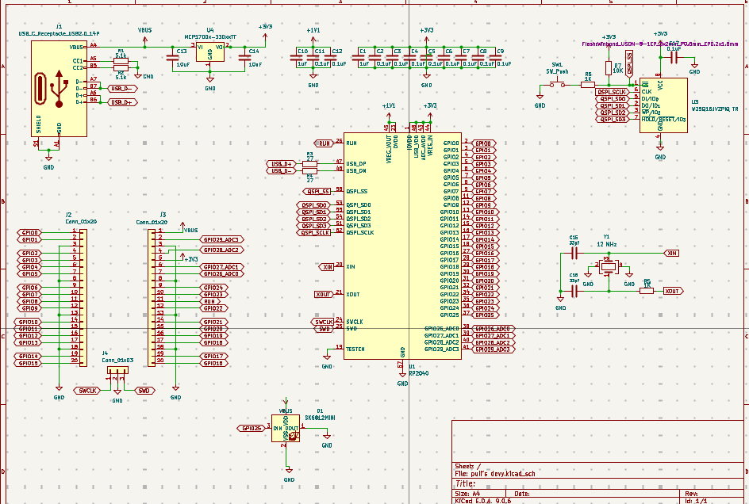
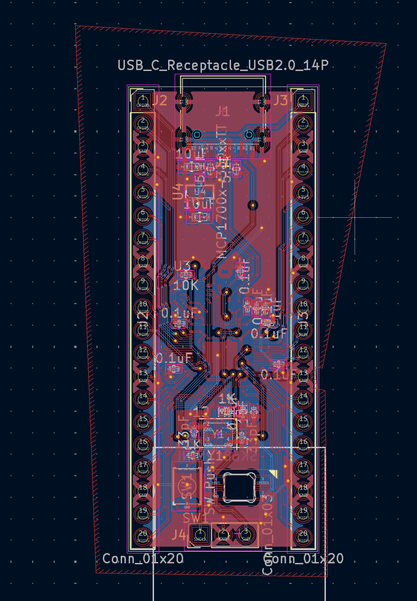

# puli_dev

s a simple dev board based of rp2040. It has everything that I would want on a dev board lots of GPIOs, plenty of grounds, and some other useful features (listed below). This was a fun and pretty easy project to make once I started to understand what I needed to do. It ended up being foundational to my ability to design PCBs, and it showed me how much I enjoy this kind of work. I hope I’ll be able to make even more dev boards later in life

# Features
1. The RP2040 is the brain of this project handling all of the processing
2. this uses the W25Q16JVZPIQ with a whopping 16-Megabit flash menmory
3. Usbc this is just a normal USB-C Receptical to send data and also power 
4. one pin for 5v power and another pin for 3v power 
5. 9 pins for ground to make it easy to ground everything you need to 
6. this board comes wih 29 gpio pins 4 of which are dual use for analog inputs (ADC pins)
7. also on this board is an led to make it easy to check if the board is powered on od if there any any problems also to help debug or even program
8. and finaly a button to enter into BOOTSEL mode so you can program you board.

# schematic

# PCB Layout

